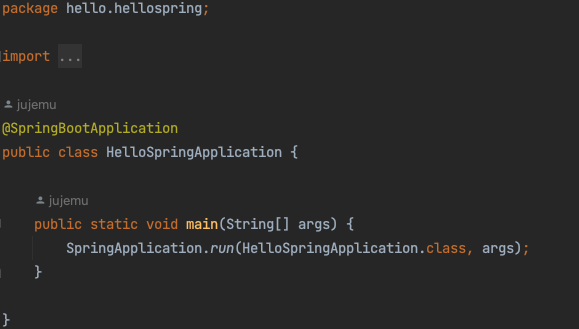
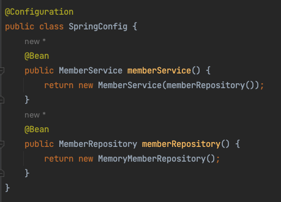

# 스프링

## 스프링 부트 라이브러리

- spring-boot-starter-web
    - spring-boot-starter-tomcat: 톰캣 (웹서버)
    - spring-webmvc: 스프링 웹 MVC
- spring-boot-starter(공통): 스프링 부트 + 스프링 코어 + 로깅
    - spring-boot
        - spring-core
    - spring-boot-starter-logging
        - logback(구현체), slf4j(인터페이스)
- spring-boot-starter-test
    - junit
    - mockito
    - assertj
    - spring-test(스프링 통합 테스트 지원)

## 스프링 빈

- SpringBootApplication 어노테이션의 같거나 하위 패키지에서 컴포넌트를 스캔한다.
- @Component 이 있으면 스프링 빈에 등록된다.
- @Controller, @Service, @Repository는 내부에 @Component를 포함한다.
- 스프링 컨테이너에 빈을 등록할 때는 기본적으로 싱글톤으로 등록한다.

### 스프링 빈 등록 방법

하나는 위에서 알아본 @Component 를 사용하는 것이고 다른 방법을 알아보자.

@Configuration으로 정의한 클래스에서 @Bean 의 반환값으로 빈을 등록한다.

정형화된 코드는 컴포넌트 스캔을 사용하도록 하고,

상황에 따라 구현 객체를 변경해야하면 스프링 빈으로 등록한다.

## 테스트 코드

- 다른 테스트의 실행 여부, 순서와 상관없이 테스트 통과를 보장해야한다.
- 테스트 db를 따로 두거나 로컬에서 실행하여 운영 db에 영향을 주어선 안된다.
- 반복해서 실행해도 통과해야한다.

## AOP

*Aspect Oriented Programming*

### AOP가 필요한 상황

모든 메소드의 호출 시간을 측정하는 것과 같이 핵심 관심 사항 외에 공통 관심 사항의 처리에서 적용할 수 있다.

예를 들어 모든 메소드의 호출 시간을 측정하기 위해서는 모든 메서드에 코드를 수정해야한다. 만약 힘겹게 모든 메서드의 수정을 완료했더니 메소드의 호출 시간 단위를 변경해야 한다면? 또한 메서드에 핵심 비즈니스 로직 외에 다른 요소가 섞여있으면 소프트웨어 품질을 떨어뜨린다.